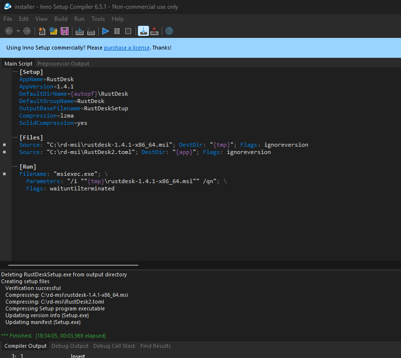

# RustDesk Self-Hosted Server & Custom Installer

This project documents the setup of a **self-hosted RustDesk server (hbbs + hbbr)** on a VPS and the creation of a **custom Windows installer (EXE)** using Inno Setup with pre-configured server settings.

---

## Features
- Self-hosted RustDesk server running in Docker (hbbs + hbbr).  
- Secure custom configuration (`RustDesk2.toml`) embedded in the installer.  
- Professional Windows installer built with **Inno Setup**.  
- Automated installation of the RustDesk MSI with pre-applied settings.  
- Documented step-by-step deployment process.  

---

## Tech Stack
- **Server:** Ubuntu 22.04 LTS on AWS EC2  
- **Containers:** Docker & Docker Compose  
- **Remote Tool:** RustDesk (self-hosted)  
- **Installer:** Inno Setup 6  
- **Languages:** Shell, Inno Setup Script  

---

## Repository Structure
```
server/     → Docker setup for hbbs/hbbr
installer/  → MSI, config, and Inno Setup script
docs/       → Screenshots documenting the process
```

---

## Deployment Steps

### Server Setup
1. Provision an **Ubuntu VPS** (tested on AWS EC2).  
2. Open required ports `21115–21119` (TCP/UDP) in the firewall or security group.  
3. Deploy RustDesk server using Docker:
   ```bash
   sudo docker compose up -d
   ```
4. Verify services:
   ```bash
   sudo ss -tulpn | grep 211
   sudo docker logs -f hbbs
   sudo docker logs -f hbbr
   ```

### Installer Setup
1. Place `rustdesk-1.4.1-x86_64.msi` and `RustDesk2.toml` inside the `installer/` folder.  
2. Compile the installer with **Inno Setup** (`setup.iss`).  
3. The output EXE will be available in `/installer/output/`.  

### Client Configuration
1. Install the generated **EXE** on Windows.  
2. RustDesk will automatically point to your **custom server**.  
3. No manual configuration is required for the end-user.  

---

## Screenshots  

### Server running in Docker  
  

### Inno Setup script ready  
  

### Installer built successfully  
  

### Client with pre-configured server  
  

### Successful remote connection test  
  

---

## License
MIT License – feel free to use, modify, and share.

---

## Author
Created by **Daniel Bracho**  
GitHub: [@Danibrh](https://github.com/Danibrh)  
